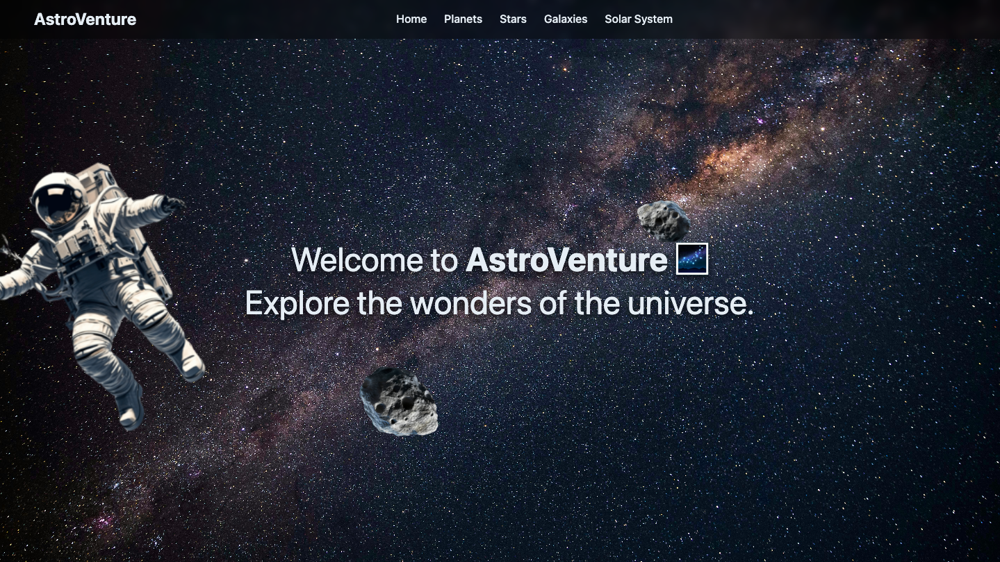

# AstroVenture 🚀

AstroVenture is a multi-page web app for exploring space in a fun, informative way — built as a themed journey through planets, galaxies, the solar system, and stars.

## Pages

| Page | File | Description |
|---|---|---|
| Home | `index.html` | Landing page and entry point to the experience |
| Planets | `planets.html` | Explore the planets of our solar system |
| Galaxies | `galaxies.html` | A look at galaxies beyond our own |
| Solar System | `solarsystem.html` | Overview of the solar system as a whole |
| Stars | `stars.html` | Facts and visuals about stars |

## Tech Stack

- HTML5
- CSS3
- JavaScript

## Running Locally

No build step or dependencies required.

**Option 1 — Quickest**
1. Clone the repo: `git clone https://github.com/Ashmita-Nath/AstroVenture-.git`
2. Open `index.html` directly in your browser (double-click the file, or right-click → Open With → your browser).

**Option 2 — Recommended (fixes relative-path/asset issues)**
1. Open the project folder in VS Code (or your editor of choice).
2. Install the **Live Server** extension.
3. Right-click `index.html` → **Open with Live Server**.
4. The site opens at a `localhost` URL and auto-refreshes as you edit.

**Option 3 — No extensions needed**
```bash
cd AstroVenture-
python3 -m http.server 8000
```
Then visit `http://localhost:8000` in your browser.

## Screenshots


## Home 


 
 

## Demo

[Live Demo](https://unrivaled-daffodil-4cc1c2.netlify.app/)

A screen recording of the app in action is included in the repo (`Screen Recording 2025-08-30 at 1.41.34 AM.mov`).


A screen recording of the app in action is included in the repo (`Screen Recording 2025-08-30 at 1.41.34 AM.mov`).

## Author

Ashmita N Nath — [GitHub](https://github.com/Ashmita-Nath)
